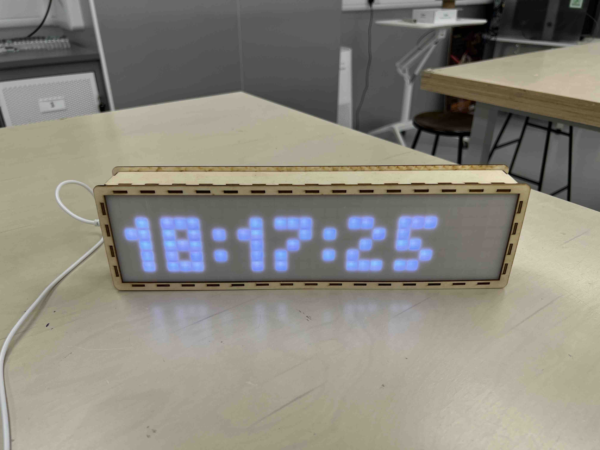

## 10. Connect to WiFi & Show the Time

1. Copy the following code:

   ```C++
   #include <Adafruit_GFX.h>
   #include <Adafruit_NeoMatrix.h>
   #include <Adafruit_NeoPixel.h>
   #include <Fonts/TomThumb.h>
   
   #include <WiFi.h>
   #include <HTTPClient.h>
   #include <time.h>
   
   // Initialize an Adafruit NeoMatrix instance
   Adafruit_NeoMatrix matrix = Adafruit_NeoMatrix(
       32, // Matrix width in pixels.
       8,  // Matrix height in pixels.
       13, // ESP32 pin number for NeoPixel data out.
       // Matrix layout settings - add together NEO_MATRIX_* values to declare orientation, rotation, etc.
       NEO_MATRIX_TOP + NEO_MATRIX_LEFT + NEO_MATRIX_COLUMNS + NEO_MATRIX_PROGRESSIVE + NEO_MATRIX_ZIGZAG,
       // NeoPixel LED type settings
       NEO_GRB + NEO_KHZ800
   );
   
   // The setup function is called once at startup
   void setup() {
       // Setting preferences for the matrix instance
       matrix.begin();
       matrix.setTextWrap(false);
       matrix.setBrightness(30);
       matrix.setFont(&TomThumb);
   
       // Set the username and password of the WiFi that the ESP32 is supposed to connect to.
       // After this is set, ESP32 will connect to this WiFi and reconnect to it automatically when disconnected later.
       WiFi.begin("Justus' iPhone", "wwwwqqqq");
   
       // Try to connect to the WiFi
       while(WiFi.status() != WL_CONNECTED) {
           // While ESP32 is automatically trying to connect to the WiFi in the background,
           // show a "No WiFi!" message on the screen. Wait for 500ms before returning to the beginning
           // of the function and trying again.
           matrix.fillScreen(matrix.Color(0, 0, 0)); // Clear the screen
           matrix.setCursor(1, 7); // The cursor has to be reset everytime before printing something on the screen
           matrix.print("No WiFi!"); // Writes the text to be shown to the internal buffer
           matrix.show(); // Draw text in the internal buffer on the screen
           delay(500);
       }
   
       // Configure the NTP client for later use
       int gmtOffset = 8; // HKT (GMT+8)
       configTime(gmtOffset * 60 * 60, 0, "pool.ntp.org");
   }
   
   // The loop function is called repeatedly after the setup function is finished.
   void loop() {
       struct tm timeinfo;
       if (!getLocalTime(&timeinfo))
           return;
   
       char msg[16];
       strftime(msg, sizeof(msg), "%H:%M:%S", &timeinfo);
       
       matrix.fillScreen(matrix.Color(0, 0, 0)); // Clear the screen
       matrix.setCursor(1, 7); // The cursor has to be reset everytime before printing something on the screen
       matrix.print(msg); // Writes the text to be shown to the internal buffer
       matrix.show(); // Draw text in the internal buffer on the screen
       
       delay(1000);
   }
   ```

2. Change `WiFi.begin("Your WiFi Name", "Your WiFi Password");` to the Wi-Fi Name and Wi-Fi Password of your mobile
   hotspot (or our provided Wi-Fi hotspot).

   e.g., If the Wi-Fi name is `Apple` and the password is `Banana`, then the line should be `WiFi.begin("Apple",
   "Banana");`

3. Upload the code.



- After the program is flashed, the ESP32 will restart, then try to connect to the WiFi using the predefined
  credentials. After connecting it successfully, the current time will be shown on the screen.
- Even if the WiFi is disconnected after initialisation, the time will still be updated offline.
- It fetches the current time using the NTP (Network Time Protocol) from the official NTP Project server (pool.ntp.org).
- Time offset can be freely adjusted

### Mini Challenges

- Display the current date instead (Hint: Use `%Y-%m-%d` in `strftime` function).
