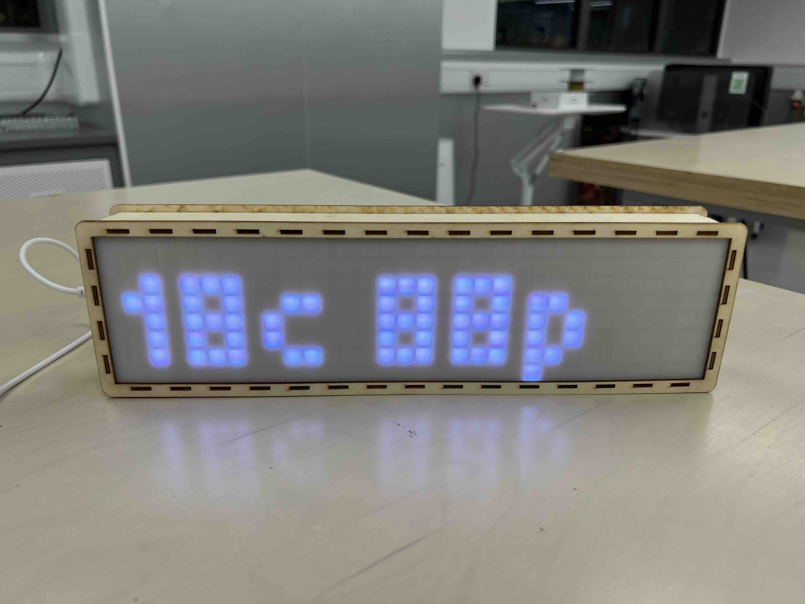

## 11. Connect to WiFi & Show the Temperature

1. Before uploading the code, install the `ArduinoJson` library.

    - Go to `Sketch` > `Include Library` > `Manage Libraries`.
    - Search for `ArduinoJson`.
    - Click on the `ArduinoJson` library.
    - Click the `Install` button.
    - If a window appears asking you to install dependencies, click `Install All`.
    - Wait for the installation to complete.
    - Close the Library Manager window.

2. Copy the following code:

   ```C++
   #include <Adafruit_GFX.h>
   #include <Adafruit_NeoMatrix.h>
   #include <Adafruit_NeoPixel.h>
   #include <Fonts/TomThumb.h>
   
   #include <WiFi.h>
   #include <HTTPClient.h>
   #include <ArduinoJson.h>
   
   // Initialize an Adafruit NeoMatrix instance
   Adafruit_NeoMatrix matrix = Adafruit_NeoMatrix(
       32, // Matrix width in pixels.
       8,  // Matrix height in pixels.
       13, // ESP32 pin number for NeoPixel data out.
       // Matrix layout settings - add together NEO_MATRIX_* values to declare orientation, rotation, etc.
       NEO_MATRIX_TOP + NEO_MATRIX_LEFT + NEO_MATRIX_COLUMNS + NEO_MATRIX_PROGRESSIVE + NEO_MATRIX_ZIGZAG,
       // NeoPixel LED type settings
       NEO_GRB + NEO_KHZ800
   );
   
   // The setup function is called once at startup
   void setup() {
       // Setting preferences for the matrix instance
       matrix.begin();
       matrix.setTextWrap(false);
       matrix.setBrightness(30);
       matrix.setFont(&TomThumb);
   
       // Set the username and password of the WiFi that the ESP32 is supposed to connect to.
       // After this is set, ESP32 will connect to this WiFi and reconnect to it automatically when disconnected later.
       WiFi.begin("Justus' iPhone", "wwwwqqqq");
   
       // Try to connect to the WiFi
       while(WiFi.status() != WL_CONNECTED) {
           // While ESP32 is automatically trying to connect to the WiFi in the background,
           // show a "No WiFi!" message on the screen. Wait for 500ms before returning to the beginning
           // of the function and trying again.
           matrix.fillScreen(matrix.Color(0, 0, 0)); // Clear the screen
           matrix.setCursor(1, 7); // The cursor has to be reset everytime before printing something on the screen
           matrix.print("No WiFi!"); // Writes the text to be shown to the internal buffer
           matrix.show(); // Draw text in the internal buffer on the screen
           delay(500);
       }
   }
   
   // The loop function is called repeatedly after the setup function is finished.
   void loop() {
       // Create an instance of the HTTP client, and perform a HTTP GET request to the below URL.
       HTTPClient http;
       http.begin("https://data.weather.gov.hk/weatherAPI/opendata/weather.php?dataType=rhrread");
   
       // Check the HTTP response code. If successful, the response code should be 200.
       // If it is successful, show an error message on the screen and wait for 1 second before
       // returning to the beginning of the function and try again.
       int httpCode = http.GET();
       if (httpCode != HTTP_CODE_OK) {
           matrix.fillScreen(matrix.Color(0, 0, 0));
           matrix.setCursor(1, 7);
           matrix.print("Error!");
           matrix.show();
           delay(5 * 60 * 1000);
           return;
       }
   
       String payload = http.getString();
   
       DynamicJsonDocument doc(8192);
       deserializeJson(doc, payload);
       
       int temperature = doc["temperature"]["data"][0]["value"].as<int>();
       int humidity = doc["humidity"]["data"][0]["value"].as<int>();
       char msg[16];
       snprintf(msg, sizeof(msg), "%dc %dp", temperature, humidity);
   
       matrix.fillScreen(matrix.Color(0, 0, 0));
       matrix.setCursor(1, 7);
       matrix.print(msg);
       matrix.show();
   
       delay(5 * 60 * 1000);
   }
   ```

3. Change `WiFi.begin("Your WiFi Name", "Your WiFi Password");` to the Wi-Fi Name and Wi-Fi Password of your mobile
   hotspot (or our provided Wi-Fi hotspot).

   e.g., If the Wi-Fi name is `Apple` and the password is `Banana`, then the line should be `WiFi.begin("Apple",
   "Banana");`

4. Upload the code.



- `18c 88p` means that currently it is 18°C and 88% humidity.
- The data is fetched from Hong Kong Observatory's API.
- It is refreshed every 5 minutes.