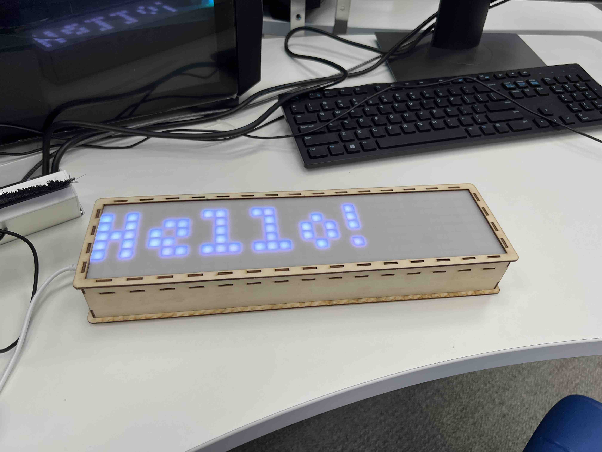

## 8. Upload Sample Program

In this section, you can program the ESP32 to display messages on the LED matrix using the Arduino IDE and C++
programming language.

### 8.1. Installing Arduino IDE

---

If you are using a computer in HKU InnoWing, it should already have the Arduino IDE installed. You may skip this step.

---

1. Go to the Arduino website at https://www.arduino.cc/en/software
2. Download the Arduino IDE for your operating system (Windows, Mac, or Linux).
3. Install the Arduino IDE by following the on-screen instructions.

### 8.2. Installing ESP32 Support

1. Open the Arduino IDE.
2. Go to `File` > `Preferences`.
3. In the `Additional Boards Manager URLs` field, enter the following
   URL: `https://raw.githubusercontent.com/espressif/arduino-esp32/gh-pages/package_esp32_index.json`
4. Click the `OK` button.
5. Go to `Tools` > `Board` > `Boards Manager`.
6. Search for `esp32`.
7. Click on the `esp32` board.
8. Click the `Install` button.
9. Wait for the installation to complete.
10. Close the Boards Manager window.

### 8.3. Installing Adafruit_NeoMatrix Library

1. Go to `Sketch` > `Include Library` > `Manage Libraries`.
2. Search for `Adafruit_NeoMatrix`.
3. Click on the `Adafruit_NeoMatrix` library.
4. Click the `Install` button.
5. If a window appears asking you to install dependencies, click `Install All`.
6. Wait for the installation to complete.
7. Close the Library Manager window.

### 8.4. Uploading your first sketch to ESP32

1. Start a new sketch.
2. Enter the following code:
   ```C++
   #include <Adafruit_GFX.h>
   #include <Adafruit_NeoMatrix.h>
   #include <Adafruit_NeoPixel.h>
   #include <Fonts/TomThumb.h>
   
   // Initialize an Adafruit NeoMatrix instance
   Adafruit_NeoMatrix matrix = Adafruit_NeoMatrix(
       32, // Matrix width in pixels.
       8,  // Matrix height in pixels.
       13, // ESP32 pin number for NeoPixel data out.
       // Matrix layout settings - add together NEO_MATRIX_* values to declare orientation, rotation, etc.
       NEO_MATRIX_TOP + NEO_MATRIX_LEFT + NEO_MATRIX_COLUMNS + NEO_MATRIX_PROGRESSIVE + NEO_MATRIX_ZIGZAG,
       // NeoPixel LED type settings
       NEO_GRB + NEO_KHZ800
   );
   
   // The setup function is called once at startup
   void setup() {
       // Setting preferences for the matrix instance
       matrix.begin();
       matrix.setTextWrap(false);
       matrix.setBrightness(30);
       matrix.setFont(&TomThumb);
   
       // Print out a simple "Hello!" message
       matrix.print("Hello!");
       matrix.show();
   }
   
   // The loop function is called repeatedly after the setup function is finished.
   void loop() {
   
   }
   ```
3. Connect the ESP32 to your computer via a USB-C cable.
4. Go to `Tools` > `Board` and select `ESP32 Arduino` > `ESP32 Dev Module`.
5. Go to `Tools` > `Port` and select the COM port that the ESP32 is connected to (e.g., `COM4`)
6. Go to `Tools` > `Upload Speed` and select `921600`.
7. Click the Upload button on the top left of the Arduino IDE (An right-pointing arrow).
8. Wait for the Arduino IDE to flash the program into ESP32.
9. After the program is flashed, the text “Hello!” will be shown on the screen.


